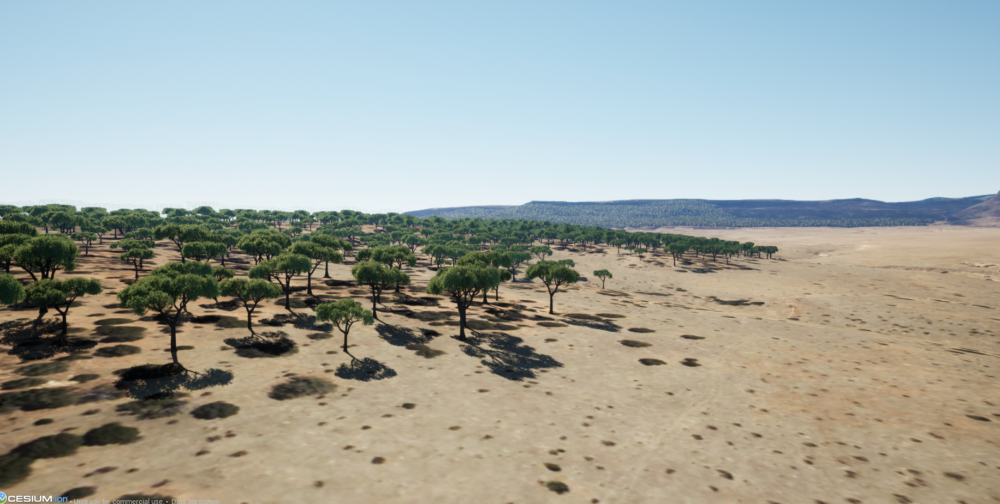

# GenericFoliage (v 0.5)
This plugin allows you to spawn foliage into planetary worlds in Unreal Engine 5, using geospatial data. It is intended to be generic and extendable by the developer.

## Geometry (GeoJSON) foliage spawner
The geometry-based spawner allows you to load a GeoJSON into the engine and spawn foliage instances at runtime.

The **AClusterFoliageActor** class contains the spawner logic, along with GeoJSON parsing, etc. Multiple instances of these actors can exist in the world and invoked immediately or on-demand.

It can also be extended to stream geojson contents from the web if needed.

Each GeoJSON feature requires the field `type` in it's properties. It is a whole number describing the foliage types to spawn.

Foliage types are handled in the **UGenericFoliageCollection**, which contains a map of integers to an array of **UGenericFoliageType**.

### Currently supported geometry types:

| Geometry Type  | Status |
|---|---|
| Point | ❌ Not Supported |
| MultiPoint | ❌ Not Supported |
| Polygon | ✅ Supported |
| MultiPolygon | ❌ Not Supported |

### Examples in Cesium:

https://github.com/SquarerFive/CesiumFoliageExample

## Rasterized spawner

This is a grid based spawner using render targets to place the foliage instances, colour, normal and depth channels are used to determine where and how they should be spawned.

### Current Features
- Foliage points are sampled from render targets for colour, normal and depth so line traces aren't used.
- Works on planets and flat surfaces.
- HISMs are partitioned into tiles, so they can gradually be updated without impacting performance too signficantly.
- Collision is only enabled on the active tile (closest to the camera). This is done to speed up the time taken to add instances to the HISM.

